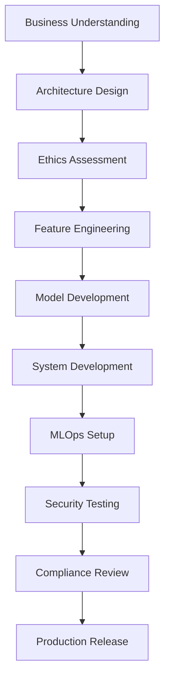

# AISG 6-Month MVP Project Workflow

## Workflow Metadata
- **Duration**: 24 weeks (6 months)
- **Team Composition**: 1 AI Engineer + 2-6 Apprentices
- **Objective**: Build production-ready MVP with comprehensive features
- **Delivery Model**: Phased approach with quality gates

## Workflow Phases

### Phase 1: Discovery & Planning (Weeks 1-4)

#### Active Agents
- Sophia D'Cruz (Senior Data Scientist) - Lead
- Rizwan bin Abdullah (ML/AI System Architect) - Support
- Priya Sharma (ML Security & Ethics Specialist) - Compliance

#### Week 1-2: Business Understanding
**Lead: Sophia D'Cruz**

##### Tasks
1. Execute `tasks/business-requirements-analysis.md`
2. Execute `tasks/data-exploration.md`
3. Execute `tasks/statistical-analysis.md`

##### Templates
- Generate `templates/analysis-report-tmpl.yaml`
- Generate `templates/data-card-tmpl.yaml`

##### Deliverables
- [ ] Business requirements document
- [ ] Initial data assessment report
- [ ] Stakeholder alignment confirmation

##### Quality Gates
- [ ] Data availability confirmed
- [ ] Business objectives clearly defined
- [ ] Success metrics established

#### Week 3-4: Architecture & Ethics Planning
**Lead: Rizwan bin Abdullah & Priya Sharma**

##### Tasks
1. Execute `tasks/architecture-design.md`
2. Execute `tasks/model-selection.md`
3. Execute `tasks/bias-assessment.md`
4. Execute `tasks/privacy-impact-assessment.md`

##### Templates
- Generate `templates/ml-architecture-tmpl.yaml`
- Generate `templates/ethics-assessment-report-tmpl.yaml`

##### Deliverables
- [ ] System architecture document
- [ ] Model selection rationale
- [ ] Ethics assessment report
- [ ] Privacy impact assessment

##### Quality Gates
- [ ] Architecture approved by stakeholders
- [ ] Ethics review completed
- [ ] Compliance requirements identified

---

### Phase 2: Experimentation (Weeks 5-12)

#### Active Agents
- Sophia D'Cruz (Senior Data Scientist) - Feature Engineering
- Marcus Tan Wei Ming (ML/AI Engineer & MLOps Specialist) - Lead Model Development

#### Week 5-8: Feature Engineering & Baseline
**Lead: Sophia D'Cruz**

##### Tasks
1. Execute `tasks/feature-engineering.md`
2. Execute `tasks/feature-importance-analysis.md`
3. Execute `tasks/data-quality-assessment.md`
4. Execute `tasks/correlation-analysis.md`

##### Templates
- Generate `templates/experiment-design-tmpl.yaml`

##### Deliverables
- [ ] Feature engineering pipeline
- [ ] Feature importance report
- [ ] Baseline model established
- [ ] Data quality report

##### Quality Gates
- [ ] Feature validation complete
- [ ] Baseline performance documented
- [ ] Data quality meets standards

#### Week 9-12: Model Development
**Lead: Marcus Tan Wei Ming**

##### Tasks
1. Execute `tasks/model-development.md`
2. Execute `tasks/hyperparameter-tuning.md`
3. Execute `tasks/ensemble-methods.md`
4. Execute `tasks/model-evaluation.md`
5. Execute `tasks/cross-validation.md`

##### Templates
- Generate `templates/model-card-tmpl.yaml`
- Generate `templates/training-pipeline-tmpl.yaml`
- Generate `templates/experiment-report-tmpl.yaml`

##### Deliverables
- [ ] Trained models (multiple versions)
- [ ] Model performance reports
- [ ] Hyperparameter tuning results
- [ ] Model cards for selected models

##### Quality Gates
- [ ] Model performance meets requirements
- [ ] Cross-validation completed
- [ ] Model documentation complete

---

### Phase 3: Productionization (Weeks 13-20)

#### Active Agents
- Marcus Tan Wei Ming (ML/AI Engineer & MLOps Specialist) - Lead Infrastructure
- Rizwan bin Abdullah (ML/AI System Architect) - System Architecture
- Sophia D'Cruz (Senior Data Scientist) - Implementation Support

#### Week 13-16: System Development
**Lead: Rizwan bin Abdullah & Sophia D'Cruz**

##### Tasks (Rizwan bin Abdullah)
1. Execute `tasks/system-architecture.md`
2. Execute `tasks/api-design.md`
3. Execute `tasks/database-design.md`
4. Execute `tasks/integration-design.md`

##### Tasks (Sophia D'Cruz)
1. Execute `tasks/api-implementation.md`
2. Execute `tasks/frontend-implementation.md`
3. Execute `tasks/data-pipeline-implementation.md`

##### Templates
- Generate `templates/fullstack-architecture-tmpl.yaml`
- Generate `templates/front-end-architecture-tmpl.yaml`
- Generate `templates/pipeline-architecture-tmpl.yaml`

##### Deliverables
- [ ] System architecture implementation
- [ ] API endpoints functional
- [ ] Frontend interface deployed
- [ ] Data pipelines operational

##### Quality Gates
- [ ] Integration tests passing
- [ ] API documentation complete
- [ ] System performance validated

#### Week 17-20: MLOps & Deployment
**Lead: Marcus Tan Wei Ming**

##### Tasks
1. Execute `tasks/ci-cd-setup.md`
2. Execute `tasks/model-serving-setup.md`
3. Execute `tasks/monitoring-setup.md`
4. Execute `tasks/containerization.md`
5. Execute `tasks/orchestration-setup.md`
6. Execute `tasks/infrastructure-provisioning.md`

##### Templates
- Generate `templates/mlops-pipeline-tmpl.yaml`
- Generate `templates/deployment-config-tmpl.yaml`
- Generate `templates/monitoring-dashboard-tmpl.yaml`

##### Deliverables
- [ ] CI/CD pipelines configured
- [ ] Model serving infrastructure
- [ ] Monitoring dashboards live
- [ ] Container deployments ready
- [ ] Infrastructure provisioned

##### Quality Gates
- [ ] Deployment pipeline tested
- [ ] Monitoring metrics validated
- [ ] Rollback procedures tested

---

### Phase 4: Validation & Security (Weeks 21-24)

#### Active Agents
- Priya Sharma (ML Security & Ethics Specialist) - Security Testing & Compliance

#### Week 21-22: Security Testing
**Lead: Priya Sharma**

##### Tasks
1. Execute `tasks/adversarial-testing.md`
2. Execute `tasks/security-audit.md`
3. Execute `tasks/penetration-testing.md`
4. Execute `tasks/vulnerability-assessment.md`
5. Execute `tasks/threat-modeling.md`

##### Templates
- Generate `templates/vulnerability-report-tmpl.yaml`
- Generate `templates/red-team-report-tmpl.yaml`
- Generate `templates/attack-playbook-tmpl.yaml`

##### Deliverables
- [ ] Security assessment report
- [ ] Vulnerability report
- [ ] Penetration test results
- [ ] Remediation recommendations

##### Quality Gates
- [ ] Critical vulnerabilities addressed
- [ ] Security standards met
- [ ] Adversarial testing passed

#### Week 23-24: Final Validation & Handover
**Lead: Priya Sharma**

##### Tasks
1. Execute `tasks/compliance-review.md`
2. Execute `tasks/fairness-evaluation.md`
3. Execute `tasks/regulatory-compliance.md`

##### Templates
- Generate `templates/compliance-report-tmpl.yaml`
- Generate `templates/bias-mitigation-plan-tmpl.yaml`

##### Deliverables
- [ ] Compliance certification
- [ ] Fairness evaluation report
- [ ] Complete documentation package
- [ ] Knowledge transfer materials
- [ ] Deployment verification report

##### Quality Gates
- [ ] All compliance requirements met
- [ ] Documentation review complete
- [ ] Handover checklist validated

---

## Success Criteria

### Technical Metrics
- Model performance meets or exceeds baseline by >15%
- System latency <100ms for 95th percentile
- System availability >99.9%
- All security tests passed
- Zero critical vulnerabilities

### Business Metrics
- User acceptance criteria met
- ROI projections validated
- Stakeholder approval obtained
- Business value demonstrated

### Process Metrics
- On-time delivery (within 6 months)
- All quality gates passed
- Documentation 100% complete
- Knowledge transfer successful

## Risk Management

### High-Risk Items
1. **Data Quality Issues**
   - Mitigation: Early data validation in Week 1-2
   - Owner: Sophia D'Cruz

2. **Model Performance**
   - Mitigation: Multiple model approaches in Week 9-12
   - Owner: Marcus Tan Wei Ming

3. **Security Vulnerabilities**
   - Mitigation: Security testing in Week 21-22
   - Owner: Priya Sharma

4. **Compliance Violations**
   - Mitigation: Ethics review throughout
   - Owner: Priya Sharma

## Communication Plan

### Weekly Sync
- Every Monday: Team standup
- Every Friday: Stakeholder update

### Phase Reviews
- End of each phase: Formal review with stakeholders
- Quality gate assessment
- Go/No-go decision for next phase

### Documentation
- Weekly: Progress reports
- Phase-end: Comprehensive documentation
- Project-end: Complete handover package

## Resource Allocation

### Human Resources
- 1 AI Engineer (100% allocation)
- 2-6 Apprentices (100% allocation)
- 4 AI Agents (activated per phase)

### Infrastructure
- Development environment (Weeks 1-12)
- Staging environment (Weeks 13-20)
- Production environment (Weeks 21-24)

### Tools & Services
- Version Control: Git/GitHub
- CI/CD: GitHub Actions/Jenkins
- Model Registry: MLflow
- Monitoring: Prometheus/Grafana
- Cloud Platform: AWS/GCP/Azure

## Checklist Validation

### Phase 1 Checklist
- [ ] Use `checklists/project-initiation-checklist.md`
- [ ] Use `checklists/data-quality-checklist.md`

### Phase 2 Checklist
- [ ] Use `checklists/experimentation-checklist.md`
- [ ] Use `checklists/model-validation-checklist.md`

### Phase 3 Checklist
- [ ] Use `checklists/deployment-readiness-checklist.md`
- [ ] Use `checklists/ml-implementation-checklist.md`

### Phase 4 Checklist
- [ ] Use `checklists/security-checklist.md`
- [ ] Use `checklists/compliance-checklist.md`

## Workflow Dependencies

## Notes
- This workflow assumes full resource availability
- Phases may overlap by 1 week for smooth transitions
- Quality gates are mandatory - no skipping allowed
- Documentation must be maintained throughout