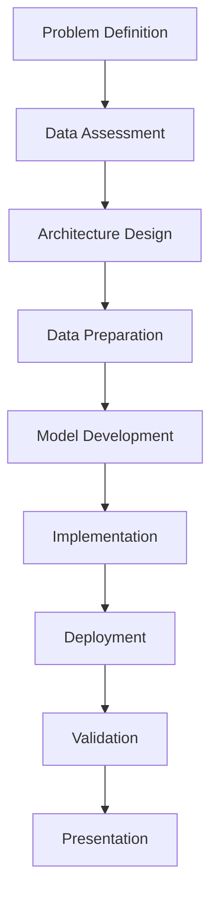

# AISG 3-Month POC Project Workflow

## Workflow Metadata
- **Duration**: 12 weeks (3 months)
- **Team Composition**: 1 AI Engineer + 2-4 Apprentices
- **Objective**: Validate technical feasibility and business value
- **Delivery Model**: Rapid prototyping with focused validation

## Workflow Phases

### Phase 1: Rapid Discovery (Weeks 1-2)

#### Active Agents
- Sophia D'Cruz (Senior Data Scientist) - Data Analysis Lead
- Rizwan bin Abdullah (ML/AI System Architect) - Architecture Support

#### Week 1: Problem Definition & Data Assessment
**Lead: Sophia D'Cruz**

##### Tasks
1. Execute `tasks/data-exploration.md` (rapid mode)
2. Execute `tasks/statistical-analysis.md` (core metrics only)
3. Execute `tasks/data-quality-assessment.md`

##### Templates
- Generate simplified `templates/analysis-report-tmpl.yaml`
- Generate `templates/data-card-tmpl.yaml`

##### Deliverables
- [ ] Problem statement validation
- [ ] Data availability confirmation
- [ ] Initial feasibility assessment
- [ ] Success criteria definition

##### Quality Gates
- [ ] Sufficient data available (>1000 samples)
- [ ] Target variable clearly defined
- [ ] Business value hypothesis stated

#### Week 2: Architecture Planning
**Lead: Rizwan bin Abdullah**

##### Tasks
1. Execute `tasks/architecture-design.md` (lightweight)
2. Execute `tasks/model-selection.md`
3. Execute `tasks/technology-selection.md`

##### Templates
- Generate POC-focused `templates/ml-architecture-tmpl.yaml`

##### Deliverables
- [ ] POC architecture diagram
- [ ] Technology stack selection
- [ ] Resource requirements
- [ ] Risk assessment

##### Quality Gates
- [ ] Architecture feasible within timeline
- [ ] Technology stack approved
- [ ] Costs within POC budget

---

### Phase 2: Rapid Prototyping (Weeks 3-8)

#### Active Agents
- Sophia D'Cruz (Senior Data Scientist) - Feature Engineering
- Marcus Tan Wei Ming (ML/AI Engineer & MLOps Specialist) - Model Development Lead

#### Week 3-4: Data Preparation
**Lead: Sophia D'Cruz**

##### Tasks
1. Execute `tasks/feature-engineering.md` (simplified)
2. Execute `tasks/outlier-detection.md`
3. Execute `tasks/correlation-analysis.md`

##### Templates
- Generate `templates/experiment-design-tmpl.yaml` (POC version)

##### Deliverables
- [ ] Feature engineering pipeline
- [ ] Data quality report
- [ ] Training/test split defined
- [ ] Baseline metrics established

##### Quality Gates
- [ ] Data quality acceptable (>90% completeness)
- [ ] Features validated
- [ ] Baseline performance documented

#### Week 5-8: Model Development & Iteration
**Lead: Marcus Tan Wei Ming**

##### Tasks
1. Execute `tasks/model-development.md` (baseline focus)
2. Execute `tasks/hyperparameter-tuning.md` (quick search)
3. Execute `tasks/model-evaluation.md`
4. Execute `tasks/cross-validation.md` (3-fold)

##### Templates
- Generate lightweight `templates/model-card-tmpl.yaml`
- Generate simplified `templates/experiment-report-tmpl.yaml`

##### Deliverables
- [ ] Working model prototype
- [ ] Model performance report
- [ ] Comparison with baseline
- [ ] Feasibility validation

##### Quality Gates
- [ ] Model performance meets minimum criteria
- [ ] Improvement over baseline demonstrated
- [ ] Technical feasibility confirmed

---

### Phase 3: POC Deployment (Weeks 9-11)

#### Active Agents
- Sophia D'Cruz (Senior Data Scientist) - Implementation Lead
- Marcus Tan Wei Ming (ML/AI Engineer & MLOps Specialist) - Deployment Lead

#### Week 9-10: Quick Implementation
**Lead: Sophia D'Cruz**

##### Tasks
1. Execute `tasks/api-implementation.md` (minimal viable)
2. Execute `tasks/frontend-implementation.md` (demo UI)
3. Execute `tasks/data-pipeline-implementation.md` (basic)

##### Templates
- Generate `templates/front-end-architecture-tmpl.yaml` (simplified)

##### Deliverables
- [ ] API endpoint functional
- [ ] Demo interface ready
- [ ] Basic data pipeline
- [ ] Integration test results

##### Quality Gates
- [ ] API responds correctly
- [ ] Demo UI functional
- [ ] End-to-end flow working

#### Week 11: Deployment & Demo Preparation
**Lead: Marcus Tan Wei Ming**

##### Tasks
1. Execute `tasks/containerization.md`
2. Execute `tasks/model-serving-setup.md` (simplified)
3. Execute `tasks/monitoring-setup.md` (basic metrics)

##### Templates
- Generate POC `templates/deployment-config-tmpl.yaml`

##### Deliverables
- [ ] Containerized application
- [ ] Deployed demo environment
- [ ] Basic monitoring setup
- [ ] Performance metrics

##### Quality Gates
- [ ] Demo environment stable
- [ ] Latency <500ms
- [ ] Basic monitoring functional

---

### Phase 4: Validation & Presentation (Week 12)

#### Active Agents
- Priya Sharma (ML Security & Ethics Specialist) - Ethics Review
- All Agents - Collaborative Validation

#### Week 12: Results & Recommendations
**Lead: Priya Sharma & All Agents**

##### Tasks (Priya Sharma)
1. Execute `tasks/bias-assessment.md` (quick check)
2. Execute `tasks/fairness-evaluation.md` (basic)
3. Execute `tasks/compliance-review.md` (preliminary)

##### Tasks (All Agents)
1. Compile results and metrics
2. Prepare presentation materials
3. Document lessons learned
4. Create recommendations for MVP

##### Templates
- Generate `templates/poc-results-tmpl.yaml`
- Generate `templates/compliance-report-tmpl.yaml` (simplified)

##### Deliverables
- [ ] POC results presentation
- [ ] Technical feasibility report
- [ ] Business value assessment
- [ ] Cost-benefit analysis
- [ ] Recommendations for MVP phase
- [ ] Risk assessment document
- [ ] Stakeholder presentation

##### Quality Gates
- [ ] All success criteria evaluated
- [ ] Go/No-go decision documented
- [ ] Stakeholder approval obtained

---

## Success Criteria

### Technical Metrics
- Model performance improvement >10% over baseline
- API latency <500ms for 95th percentile
- System stability during demo period
- Successful end-to-end demonstration

### Business Metrics
- Clear value proposition validated
- ROI projection positive
- Stakeholder interest confirmed
- Use case viability proven

### Process Metrics
- On-time delivery (within 3 months)
- All POC objectives met
- Documentation complete
- Knowledge transfer successful

## Risk Management

### High-Risk Items
1. **Data Availability**
   - Mitigation: Early validation in Week 1
   - Owner: Sophia D'Cruz

2. **Time Constraints**
   - Mitigation: Focus on MVP features only
   - Owner: Marcus Tan Wei Ming

3. **Stakeholder Alignment**
   - Mitigation: Weekly updates and demos
   - Owner: Project Lead

## Communication Plan

### Weekly Cadence
- Monday: Team standup (30 min)
- Wednesday: Progress check (15 min)
- Friday: Stakeholder update (30 min)

### Key Milestones
- Week 2: Architecture review
- Week 4: Data readiness checkpoint
- Week 8: Model performance review
- Week 11: Demo preview
- Week 12: Final presentation

## Resource Allocation

### Human Resources
- 1 AI Engineer (100% allocation)
- 2-4 Apprentices (100% allocation)
- 5-6 AI Agents (activated per phase)

### Infrastructure
- Development environment (cloud-based)
- Compute: 1 GPU instance for training
- Storage: 100GB for data and models
- Demo hosting: Container platform

### Budget Constraints
- Total budget: $50,000
- Compute: $20,000
- Personnel: $25,000
- Tools/Services: $5,000

## Workflow Dependencies

## Checklist Validation

### Phase 1 Checklist
- [ ] Use `checklists/data-quality-checklist.md`
- [ ] Use `checklists/poc-readiness-checklist.md`

### Phase 2 Checklist
- [ ] Use `checklists/experimentation-checklist.md`
- [ ] Use `checklists/model-validation-checklist.md`

### Phase 3 Checklist
- [ ] Use `checklists/deployment-readiness-checklist.md`

### Phase 4 Checklist
- [ ] Use `checklists/poc-completion-checklist.md`

## Notes
- Focus on proving concept viability, not production readiness
- Prioritize speed over perfection
- Document all assumptions and limitations
- Prepare clear go/no-go criteria for MVP phase